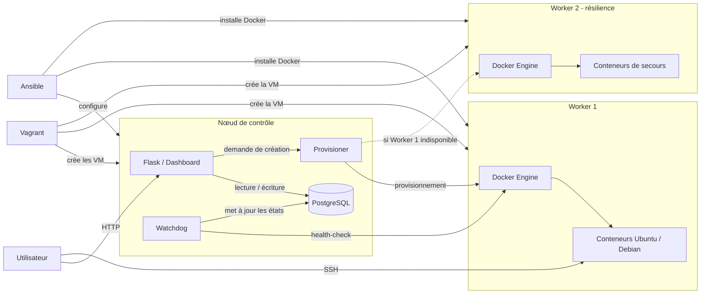

# Architecture du projet

```mermaid
flowchart LR

    U[Utilisateur]

    subgraph CONTROL["Nœud de contrôle"]
        F[Flask / Dashboard]
        DB[(PostgreSQL)]
        P[Provisioner]
        W[Watchdog]
    end

    subgraph WORKER1["Worker 1"]
        D1[Docker Engine]
        C1[Conteneurs Ubuntu / Debian]
    end

    subgraph WORKER2["Worker 2 - résilience"]
        D2[Docker Engine]
        C2[Conteneurs de secours]
    end

    V[Vagrant]
    A[Ansible]

    U -->|HTTP| F

    F -->|lecture / écriture| DB
    F -->|demande de création| P

    P -->|provisionnement| D1
    D1 --> C1

    U -->|SSH| C1

    W -->|health-check| D1
    W -->|met à jour les états| DB

    V -->|crée les VM| CONTROL
    V -->|crée la VM| WORKER1
    V -->|crée la VM| WORKER2

    A -->|configure| CONTROL
    A -->|installe Docker| WORKER1
    A -->|installe Docker| WORKER2

    P -.->|si Worker 1 indisponible| D2
    D2 --> C2
```
