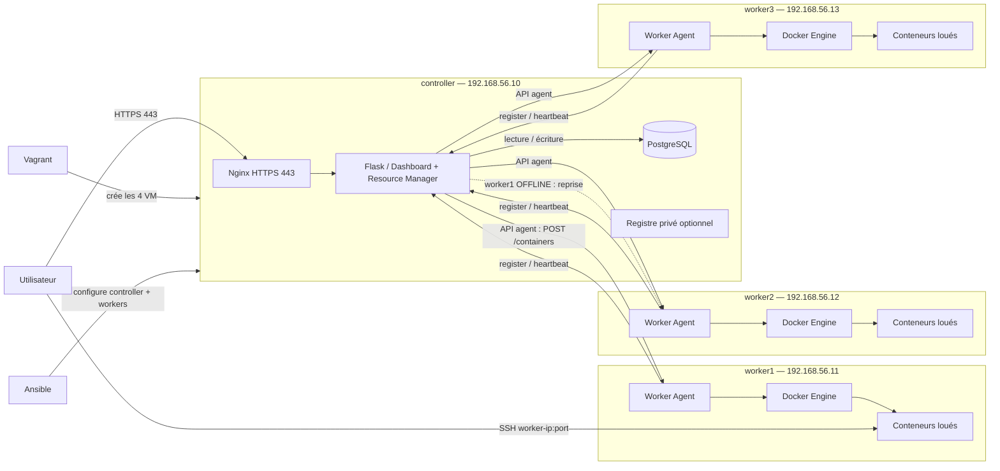

# Architecture du projet Shellter

> Aligné sur le sujet officiel (Projet 3, Dr. N. Fettah) : **1 controller + 3 workers**, **Worker
> Agent** (register + heartbeat), distributions **Ubuntu / Debian / Alpine**, rendu final en **HTTPS**.

## Vue d'ensemble

L'infrastructure compte **4 VM Vagrant** :

- un **controller** (control plane) qui fait tourner toute la stack web via **Docker Compose**
  (Nginx en HTTPS, Flask, PostgreSQL, registre privé optionnel) ;
- **3 workers** (`worker1`, `worker2`, `worker3`), chacun avec Docker Engine et un **Worker Agent**
  (service systemd) qui enregistre le worker, envoie un heartbeat et pilote les conteneurs loués.

**Principe de sécurité** : Flask ne parle **jamais** directement au démon Docker d'un worker. Il
appelle l'**API du Worker Agent**, qui utilise le SDK Docker en local. Le socket Docker n'est donc
jamais exposé sur le réseau.

## Diagramme

## Machines, IP et hostnames

| Machine | IP privée | Hostname | Rôle | Contenu |
|---|---|---|---|---|
| controller | `192.168.56.10` | `controller` | Control plane | Docker Compose : Nginx (HTTPS), Flask, PostgreSQL, registre privé (optionnel) |
| worker1 | `192.168.56.11` | `worker1` | Worker | Docker Engine + Worker Agent (systemd) |
| worker2 | `192.168.56.12` | `worker2` | Worker | idem |
| worker3 | `192.168.56.13` | `worker3` | Worker | idem |

Réseau privé Vagrant : `192.168.56.0/24` (host-only).

## Ports et flux réseau

| Flux | Source | Destination | Port | Protocole |
|---|---|---|---|---|
| Accès utilisateur | client | controller (Nginx) | **443** | HTTPS |
| Redirection | client | controller (Nginx) | 80 → 443 | HTTP → HTTPS |
| Reverse proxy | Nginx | Flask | 8000 (interne) | HTTP |
| Accès base | Flask | PostgreSQL | 5432 (interne Compose) | TCP |
| Pilotage conteneurs | Flask / Resource Manager | Worker Agent | 5000 (interne) | HTTP + token |
| Register / heartbeat | Worker Agent | Flask | 443 | HTTPS + token |
| Accès instance louée | client | worker `192.168.56.1x` | plage SSH ex. **20000–30000** | SSH |

> Le socket Docker (`/var/run/docker.sock`) reste **local** à chaque worker : jamais exposé sur le réseau.

## Distributions supportées

| Distribution | Image Docker |
|---|---|
| Ubuntu 24.04 | `ubuntu:24.04` |
| Debian 13 | `debian:13` |
| Alpine | `alpine:latest` |

Chaque image embarque `openssh-server` ; l'utilisateur et les credentials SSH sont créés à chaque
location (aucun mot de passe figé dans l'image).

## Rôle des outils

| Outil | Usage |
|---|---|
| Vagrant | Création reproductible des 4 VM + réseau privé |
| Ansible | `site.yml`, `docker.yml`, `worker.yml`, `deploy.yml`, durcissement SSH, Vault |
| Docker Compose | Stack du controller en une commande, healthchecks, redémarrage auto |
| Worker Agent | Enregistrement, heartbeat, création / suppression / surveillance des conteneurs |
| Nginx | Reverse proxy + terminaison TLS (HTTPS) |

## À clarifier avec l'enseignante (S2)

- Vagrant sert-il seulement au développement, ou aussi à la démonstration finale ?
- Un certificat auto-signé suffit-il pour le HTTPS ?
- Le registre privé peut-il être celui de GitHub / GitLab ?
