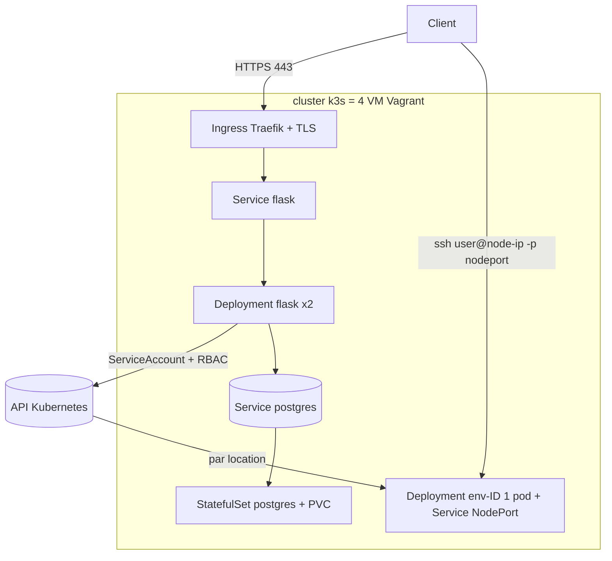

# Architecture Kubernetes — Shellter (branche `kubernetes`)

> Cadrage (séance K1, partie P4). Réimplémentation de l'orchestration de Shellter avec
> **k3s**, en réutilisant les 4 VM Vagrant comme nœuds du cluster. Les briques « maison »
> (Worker Agent, Resource Manager, reprise sur panne) sont remplacées par les mécanismes
> **natifs** de Kubernetes.

## Vue d'ensemble

- **controller** (`192.168.56.10`) : nœud **k3s server**.
- **worker1/2/3** (`.11/.12/.13`) : nœuds **k3s agents**.
- Une **location** = un **Deployment (1 replica)** + un **Service NodePort** exposant le port 22.

## Correspondance « Shellter maison → Kubernetes »

| Brique maison (main) | Équivalent Kubernetes (cette branche) |
|---|---|
| Worker Agent (`agent_client`) | l'**API Kubernetes** (`app/k8s_client.py`) |
| Resource Manager (`select_worker`) | le **scheduler** k3s |
| Heartbeat + statut worker | les **nœuds** + `kubelet` + probes |
| `/rent` → créer un conteneur | créer un **Deployment** + **Service NodePort** |
| Reprise sur panne (S7) | **re-scheduling natif** (Deployment/ReplicaSet) |
| Expiration (`end_time`) | **CronJob** de nettoyage (`k8s_reaper.py`) |
| `docker-compose` du controller | manifests **Deployment / StatefulSet / Service / Ingress** |
| Chiffrement SSH, quota, admin, migrations | **inchangés** (réutilisés tels quels) |

## Manifests produits (`k8s/`)

| Fichier | Rôle | Partie |
|---|---|---|
| `00-namespace.yaml` | namespace `shellter` | — |
| `rbac.yaml` | ServiceAccount + Role + RoleBinding | P1 |
| `secret.example.yaml` / `configmap.yaml` | secrets & config | P1 |
| `postgres-statefulset.yaml` / `postgres-service.yaml` | base persistante | P2 |
| `flask-deployment.yaml` / `flask-service.yaml` | control plane | P3 |
| `ingress.yaml` | HTTPS (Traefik + TLS) | P4 |
| `env-deployment.template.yaml` | gabarit d'une location (généré par `k8s_client`) | P1/P4 |
| `expiration-cronjob.yaml` | expiration automatique | P3 |
| `reconciler-cronjob.yaml` | réconciliation base ↔ cluster | P4 |

## Stratégie de test
- **Statique** : `kubeconform` sur tous les manifests (CI), `kube-score` (conseillé).
- **Composant** : `kubectl get nodes` (4 Ready), PVC qui survit à la suppression du pod Postgres.
- **E2E** : `/health` en HTTPS via l'Ingress ; `POST /rent` → `ssh user@<node-ip> -p <nodeport>`.
- **Résilience** : `kubectl delete pod env-<id>` → recréé ; `vagrant halt worker1` → reschedule.
- **Expiration** : location courte → CronJob supprime l'env, base cohérente.
